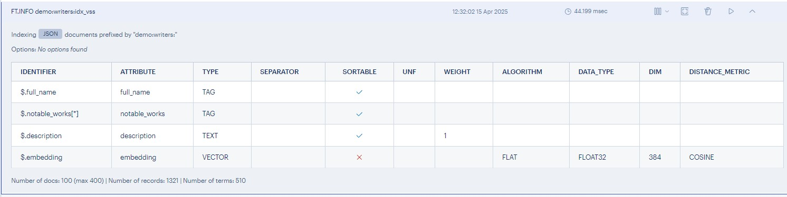
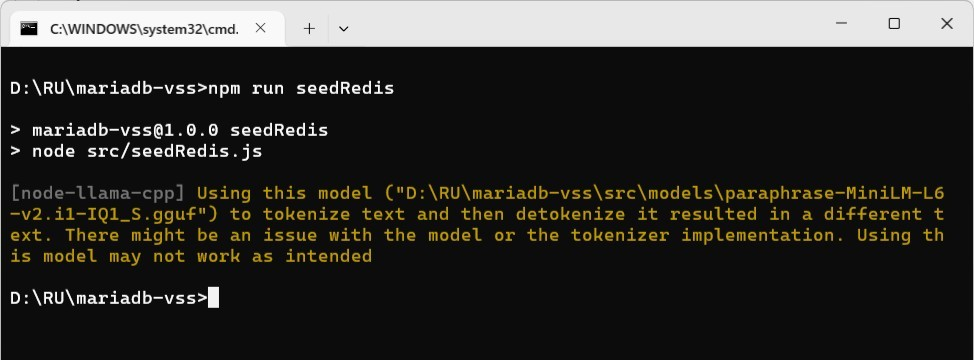
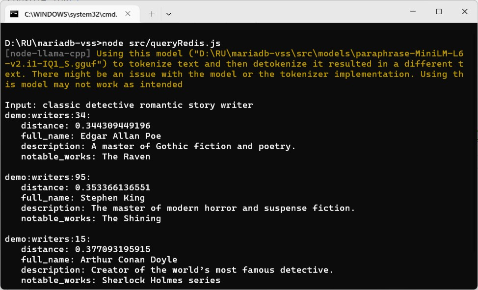
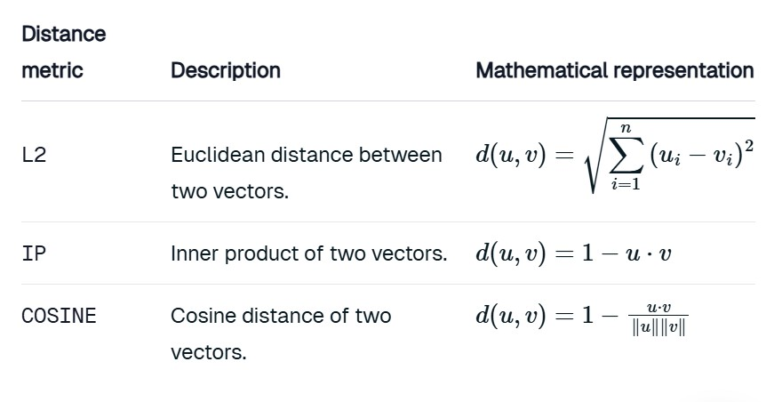
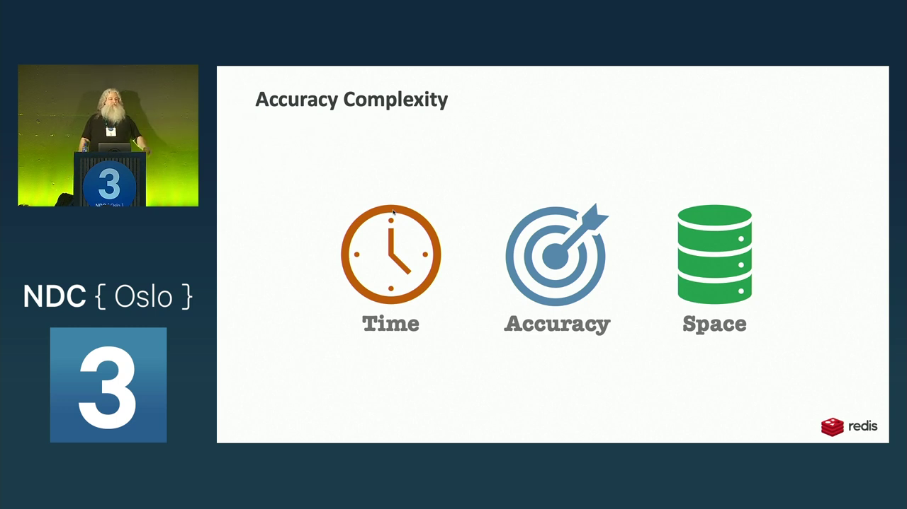

### Vector Semantic Search using MariaDB (Part 3/3)


#### Prologue 
I already know how to use vector semantic search using MariaDB. Why on earch do I need to use another database? The answer is twofold: 
1. Repeatedly querying with vectors may have negative impact on database performance; 
2. Offloading VSS to separate server would make your database more resilient and easily scale. 


#### I. The way of Redis 
To recap, our data model is like this:
```
  {
    "full_name": "Agatha Christie",
    "notable_works": [
                      "The Murder of Roger Ackroyd",
                      "The Mysterious Affair at Styles",
                      "The A.B.C. Murders",
                      "Curtain: Poirot's Last Case"
                     ],
    "description": "The queen of mystery novels with ingenious plots."
  }
```

Redis is a *schemaless* database but it does need an index when it comes to search the data: 
```
FT.CREATE demo:writers:idx_vss 
    ON JSON PREFIX 1 demo:writers: 
    SCHEMA $.full_name AS full_name TAG SORTABLE
    $.notable_works[*] AS notable_works TAG SORTABLE
    $.description AS description TEXT SORTABLE
    $.embedding AS embedding VECTOR FLAT 6
        TYPE FLOAT32
        DIM 5
        DISTANCE_METRIC COSINE
```

The next step is to insert testing data:
```
JSON.SET demo:writers:1 $ '{
        "full_name": "William Shakespeare",
        "notable_works": ["Hamlet", "Romeo and Juliet"],
        "description": "The most celebrated playwright in history, known for his tragedies and comedies.",
        "embedding": [0.11, 0.21, 0.31, 0.41, 0.51]
    }'

JSON.SET demo:writers:2 $ '{
        "full_name": "Jane Austen",
        "notable_works": ["Pride and Prejudice", "Sense and Sensibility"],
        "description": "Renowned for her sharp observations of 19th-century society and romance.",
        "embedding": [0.21, 0.22, 0.23, 0.24, 0.25]
    }'

JSON.SET demo:writers:3 $ '{
        "full_name": "Charles Dickens",
        "notable_works": ["A Tale of Two Cities", "The Mystery of Edwin Drood"],
        "description": "A Victorian novelist celebrated for his social commentary and vivid characters.",
        "embedding": [0.31, 0.32, 0.33, 0.34, 0.35]
    }'

JSON.SET demo:writers:4 $ '{
        "full_name": "George Orwell",
        "notable_works": ["1984", "Animal Farm"],
        "description": "Known for his dystopian novels critiquing political oppression.",
        "embedding": [0.41, 0.42, 0.43, 0.44, 0.45]
    }'

JSON.SET demo:writers:5 $ '{
        "full_name": "Virginia Woolf",
        "notable_works": ["Mrs. Dalloway"],
        "description": "A modernist pioneer exploring identity and consciousness.",
        "embedding": [0.51, 0.52, 0.53, 0.54, 0.55]
    }'
```
To play with the data: 
```
> FT.SEARCH demo:writers:idx_vss @description:"A master of Gothic fiction and poetry" RETURN 2 $.id $.notable_works
1) "1"
2) "demo:writers:34"
3) 1) "$.id"
   2) "34"
   3) "$.notable_works"
   4) "[\"The Raven\",\"The Narrative of Arthur Gordon Pym of Nantucket\",\"The Mystery of Marie Rog\xc3\xaat\",\"The Murders in the Rue Morgue\"]"
```

By the way, TAG field can be queried like this:
```
> FT.SEARCH demo:writers:idx_vss @notable_works:{1984}
1) "1"
2) "demo:writers:4"
3) 1) "$"
   2) "{\"full_name\":\"George Orwell\",\"notable_works\":[\"1984\",\"Animal Farm\"],\"description\":\"Known for his dystopian novels critiquing political oppression.\",\"embedding\":[0.41,0.42,0.43,0.44,0.45]}"
```

Fulltext search can be queried like this:
```
> FT.SEARCH demo:writers:idx_vss "political"
1) "1"
2) "demo:writers:4"
3) 1) "$"
   2) "{\"full_name\":\"George Orwell\",\"notable_works\":[\"1984\",\"Animal Farm\"],\"description\":\"Known for his dystopian novels critiquing political oppression.\",\"embedding\":[0.41,0.42,0.43,0.44,0.45]}"
```


#### II. The Way of Redis (cont)
Before proceeding further, let's re-create the index with proper dimensions in embedding field, which is 384!
```
FT.DROPINDEX demo:writers:idx_vss DD

FT.CREATE demo:writers:idx_vss 
    ON JSON PREFIX 1 demo:writers: 
    SCHEMA $.full_name AS full_name TAG SORTABLE
    $.notable_works[*] AS notable_works TAG SORTABLE
    $.description AS description TEXT SORTABLE
    $.embedding AS embedding VECTOR FLAT 6
        TYPE FLOAT32
        DIM 384
        DISTANCE_METRIC COSINE
```



#### III. Creating embeddings
Previously, we hardcode the embedding in `JSON.SET`. In reality, we have to use a model to create embedding on the fly. Create `seedRedis.js` as follow: 
```
// Redis
import { redisClient, disconnect } from './redis/redisClient.js'

// node-llama-cpp 
import 'dotenv/config'
import {fileURLToPath} from "url";
import path from "path";
import {getLlama} from "node-llama-cpp";

const __dirname = path.dirname(
    fileURLToPath(import.meta.url)
);

const llama = await getLlama();
const model = await llama.loadModel({
    modelPath: path.join(__dirname, "..", "src", "models", "paraphrase-MiniLM-L6-v2.i1-IQ1_S.gguf")
});
const context = await model.createEmbeddingContext();

// The writers data 
import writers from "../data/writers.json" with { type: "json" };

/*
   main
*/
async function main() {  
  writers.forEach(async (writer, index) => {
    const { vector } = await context.getEmbeddingFor(writer.description);
    /*
      You can store or update vectors and any associated metadata in JSON using the JSON.SET command.

      To store vectors in Redis as JSON, you store the vector as a JSON array of floats. Note that this differs from vector storage in Redis hashes, which are instead stored as raw bytes.
    */
    await redisClient.call("JSON.SET", `demo:writers:${index + 1}`, 
        "$", 
        JSON.stringify({
            "id": index + 1,
            "full_name": writer.full_name,
            "notable_works": writer.notable_works,
            "description": writer.description,
            "embedding": vector
        })
    );
  })
  setTimeout( async() =>{ await disconnect() }, 5000)
}

await main()
```




#### IV. Making the Vector Semantic Search
Putting all pieces of puzzle together: 

`queryRedis.js`
```
// Redis
import { redisClient, disconnect } from './redis/redisClient.js'

// node-llama-cpp 
import 'dotenv/config'
import {fileURLToPath} from "url";
import path from "path";
import {getLlama} from "node-llama-cpp";

import readline from 'readline';
const rl = readline.createInterface({
    input: process.stdin,
    output: process.stdout
});

const __dirname = path.dirname(
    fileURLToPath(import.meta.url)
);

const llama = await getLlama();
const model = await llama.loadModel({
    modelPath: path.join(__dirname, "models", "paraphrase-MiniLM-L6-v2.i1-IQ1_S.gguf")
});
const context = await model.createEmbeddingContext();

async function findSimilarDocuments(embedding, count = 3) {
    const { vector } = embedding
    const result = await redisClient.call('FT.SEARCH', 
                                        'demo:writers:idx_vss', 
                                        `(*) => [KNN ${count} @embedding $BLOB AS distance]`, 
                                        'RETURN', 5, 'distance', 'id', 'full_name', 'description', '$.notable_works',  
                                        'SORTBY', 'distance', 'ASC', 
                                        'PARAMS', '2', 'BLOB', 
                                                        Buffer.from(Float32Array.from(vector).buffer),
                                        'DIALECT', 2)
    return result;
  };

/*
   main
*/
console.log()
const askQuestion = () => {    
    rl.question('Input: ', async (query) => {
        const queryEmbedding = await context.getEmbeddingFor(query);
        const similarDocuments = await findSimilarDocuments(queryEmbedding);

        for (let i = 1; i < similarDocuments.length; i += 2) 
        {
            console.log(`${similarDocuments[i]}:`);
            for (let j = 0; j < 8; j += 2) {
                console.log(`   ${similarDocuments[i+1][j]}: ${similarDocuments[i+1][j+1]}`);
            }
            console.log()
        }
        console.log()
        askQuestion(); // Recurse to ask the question again
    });
};

askQuestion();
```



#### V. Summary 
- [Part 1](https://github.com/Albert0i/mariadb-vss/blob/main/README.md): HNSW key concepts, documentation on MariaDB and Redis; 
- [Part 2](https://github.com/Albert0i/mariadb-vss/blob/main/README.2.md): Implementation of VSS using MariaDB via Prisma ORM and node-llama-cpp; 
- [Part 3](https://github.com/Albert0i/mariadb-vss/blob/main/README.3.md): Implementation of VSS using Redis via RedisJSON, RediSearch and node-llama-cpp; 
- `writers.json` dataset is generated by AI; 
- `seed.js` is based on documentation of [Seeding](https://www.prisma.io/docs/orm/prisma-migrate/workflows/seeding) and [Using Embedding](https://github.com/withcatai/node-llama-cpp/blob/master/docs/guide/embedding.md); 
- `queryVSS.js` is based on AI generated code; 

As you can see, it is easy to start with MariaDB with just a couple of turning parameters and most developers already familiar with RDBMS. Redis, on the other hand, provides comprehensive Functionality: 
1. You can choose `HASH` or `JSON` as underlaying data structure; 
2. Either `FLAT` or `HNSW` indexing method; 
3. Three types of distance: Euclidean Distance (L2), Inner Product (IP) or Cosine Distance; 
4. Three type of queries: KNN (K-Nearest Neighbors) Query, Vector Range Query and Hybrid Query; 

You may consider MariaDB as general purpose relational database with additional vector semantic search capability, while Redis is in-memory NoSQL database featuring vector database. The term [`Approximate Nearest Neighbor (ANN)`](https://weaviate.io/blog/vector-search-explained) is algorithm which trades off a bit of accuracy for a huge gain in size and/or speed. `k-nearest neighbors (kNN)` algorithm, differs from ANN because it calculates a similarity score for every data vector in the database compared to the query vector. 


The *brute force* of a kNN search is computationally very expensive - and depending on the size of your database, a single query could take anything from several seconds to even hours. If you compare a vector with 300 dimensions with 10M vectors, the search system would need to do 300 x 10M = 3B computations! The number of required calculations increases linearly with the number of data points (O(n)).

MariaDB employs modified HNSW and most of the time delivers the correct result. This probabilistic nature allows HNSW to achieve high performance and scalability in vector similarity searches. 



#### VI. Bibliography
1. [What is a vector database?](https://youtu.be/Yhv19le0sBw)
2. [Redis as a Vector Database Explained](https://youtu.be/xhLXZ0Hqudk)
3. [Understanding Probabilistic Data Structures with 112,092 UFO Sightings - Guy Royse - NDC Oslo 2023](https://youtu.be/M6XOniVANKI)
4. [Understanding Probabilistic Data Structures with 112,092 UFO Sightings By Guy Royse](https://youtu.be/qMp6jlxC238)
5. [Search and query](https://redis.io/docs/latest/operate/oss_and_stack/stack-with-enterprise/search/)
6. [Vectors](https://redis.io/docs/latest/develop/interact/search-and-query/advanced-concepts/vectors/)
7. [FT.CREATE](https://redis.io/docs/latest/commands/ft.create/)
8. [FT.SEARCH](https://redis.io/docs/latest/commands/ft.search/)
9. [JSON](https://redis.io/docs/latest/develop/data-types/json/)
10. [The Trial by Franz Kafka](https://www.gutenberg.org/cache/epub/7849/pg7849-images.html)


#### Epilogue 
Redis commands tend to be cryptic, obfuscated and formidable. Various data structures are available and each for a special purpose, most of the time are spent on consulting [documentation](https://redis.io/docs/latest/commands/). It's not easy for developers who already accustomed to SQL to begin with. IMHO, relational database is for office task -- since most data are in *tabular* format and thus is a choice of both natural and convenient as a result, while Redis is to tackle real world issues where data are semi-structured or completely unstructured. 


### EOF (2025/04/25)