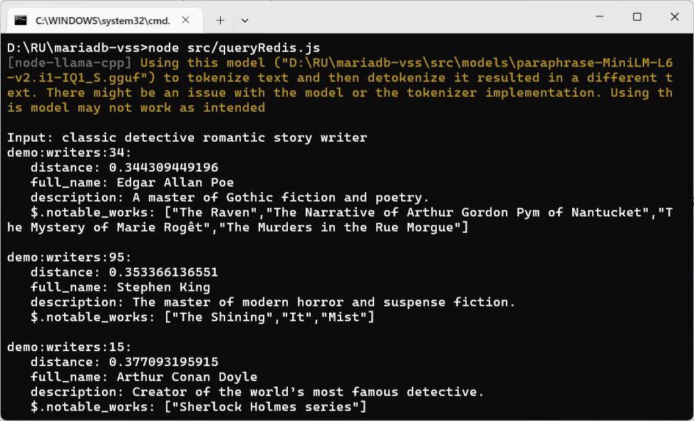

### Vector Semantic Search using MariaDB (Part 3/3)


#### Prologue 
You may ask: I already know how to use vector semantic search using MariaDB. Why on earch do I need to use another database? The answer is twofold: 
1. Repeatedly querying with vectors may have negative impact on database performance; 
2. Offloading vss to separate server would keep your database more resilient and elastic. 


#### I. The way of Redis 
To recap, our data model is like this:
```
  {
    "full_name": "Agatha Christie",
    "notable_works": [
                      "The Murder of Roger Ackroyd",
                      "The Mysterious Affair at Styles",
                      "The A.B.C. Murders",
                      "Curtain: Poirot's Last Case"
                     ],
    "description": "The queen of mystery novels with ingenious plots."
  }
```

```
FT.CREATE demo:writers:idx_vss 
    ON JSON PREFIX 1 demo:writers: 
    SCHEMA $.full_name AS full_name TAG SORTABLE
    $.notable_works[*] AS notable_works TAG SORTABLE
    $.description AS description TEXT SORTABLE
    $.embedding AS embedding VECTOR FLAT 6
        TYPE FLOAT32
        DIM 5
        DISTANCE_METRIC COSINE
```

```
JSON.SET demo:writers:1 $ '{
        "full_name": "William Shakespeare",
        "notable_works": ["Hamlet", "Romeo and Juliet"],
        "description": "The most celebrated playwright in history, known for his tragedies and comedies.",
        "embedding": [0.11, 0.21, 0.31, 0.41, 0.51]
    }'

JSON.SET demo:writers:2 $ '{
        "full_name": "Jane Austen",
        "notable_works": ["Pride and Prejudice", "Sense and Sensibility"],
        "description": "Renowned for her sharp observations of 19th-century society and romance.",
        "embedding": [0.21, 0.22, 0.23, 0.24, 0.25]
    }'

JSON.SET demo:writers:3 $ '{
        "full_name": "Charles Dickens",
        "notable_works": ["A Tale of Two Cities", "The Mystery of Edwin Drood"],
        "description": "A Victorian novelist celebrated for his social commentary and vivid characters.",
        "embedding": [0.31, 0.32, 0.33, 0.34, 0.35]
    }'

JSON.SET demo:writers:4 $ '{
        "full_name": "George Orwell",
        "notable_works": ["1984", "Animal Farm"],
        "description": "Known for his dystopian novels critiquing political oppression.",
        "embedding": [0.41, 0.42, 0.43, 0.44, 0.45]
    }'

JSON.SET demo:writers:5 $ '{
        "full_name": "Virginia Woolf",
        "notable_works": ["Mrs. Dalloway"],
        "description": "A modernist pioneer exploring identity and consciousness.",
        "embedding": [0.51, 0.52, 0.53, 0.54, 0.55]
    }'
```

By the way, JSON data can be queried like this:
```
> FT.SEARCH demo:writers:idx_vss "@notable_works:{1984}"
1) "1"
2) "demo:writers:4"
3) 1) "$"
   2) "{\"full_name\":\"George Orwell\",\"notable_works\":[\"1984\",\"Animal Farm\"],\"description\":\"Known for his dystopian novels critiquing political oppression.\",\"embedding\":[0.41,0.42,0.43,0.44,0.45]}"
```

Fulltext search can be queried like this:
```
> FT.SEARCH demo:writers:idx_vss "@description:political"
1) "1"
2) "demo:writers:4"
3) 1) "$"
   2) "{\"full_name\":\"George Orwell\",\"notable_works\":[\"1984\",\"Animal Farm\"],\"description\":\"Known for his dystopian novels critiquing political oppression.\",\"embedding\":[0.41,0.42,0.43,0.44,0.45]}"
```


#### II. The Way of Redis (cont)
```
FT.DROPINDEX demo:writers:idx_vss DD

FT.CREATE demo:writers:idx_vss 
    ON JSON PREFIX 1 demo:writers: 
    SCHEMA $.full_name AS full_name TAG SORTABLE
    $.notable_works[*] AS notable_works TAG SORTABLE
    $.description AS description TEXT SORTABLE
    $.embedding AS embedding VECTOR FLAT 6
        TYPE FLOAT32
        DIM 384
        DISTANCE_METRIC COSINE
```


#### III. Creating embeddings
Create function in `seedRedis.js` as follow: 
```
// Redis
import { redisClient, disconnect } from './redis/redisClient.js'

// node-llama-cpp 
import 'dotenv/config'
import {fileURLToPath} from "url";
import path from "path";
import {getLlama} from "node-llama-cpp";

const __dirname = path.dirname(
    fileURLToPath(import.meta.url)
);

const llama = await getLlama();
const model = await llama.loadModel({
    modelPath: path.join(__dirname, "..", "src", "models", "paraphrase-MiniLM-L6-v2.i1-IQ1_S.gguf")
});
const context = await model.createEmbeddingContext();

// The writers data 
import writers from "../data/writers.json" with { type: "json" };

/*
   main
*/
async function main() {  
  writers.forEach(async (writer, index) => {
    const { vector } = await context.getEmbeddingFor(writer.description);
    /*
      You can store or update vectors and any associated metadata in JSON using the JSON.SET command.

      To store vectors in Redis as JSON, you store the vector as a JSON array of floats. Note that this differs from vector storage in Redis hashes, which are instead stored as raw bytes.
    */
    await redisClient.call("JSON.SET", `demo:writers:${index + 1}`, 
        "$", 
        JSON.stringify({
            "id": index + 1,
            "full_name": writer.full_name,
            "notable_works": writer.notable_works,
            "description": writer.description,
            "embedding": vector
        })
    );
  })
  setTimeout( async() =>{ await disconnect() }, 5000)
}

await main()
```


#### IV. Making the Vector Semantic Search
Putting all pieces of puzzle together: 

`queryRedis.js`
```
// Redis
import { redisClient, disconnect } from './redis/redisClient.js'

// node-llama-cpp 
import 'dotenv/config'
import {fileURLToPath} from "url";
import path from "path";
import {getLlama} from "node-llama-cpp";

import readline from 'readline';
const rl = readline.createInterface({
    input: process.stdin,
    output: process.stdout
});

const __dirname = path.dirname(
    fileURLToPath(import.meta.url)
);

const llama = await getLlama();
const model = await llama.loadModel({
    modelPath: path.join(__dirname, "models", "paraphrase-MiniLM-L6-v2.i1-IQ1_S.gguf")
});
const context = await model.createEmbeddingContext();

async function findSimilarDocuments(embedding, count = 3) {
    const { vector } = embedding
    const result = await redisClient.call('FT.SEARCH', 
                                        'demo:writers:idx_vss', 
                                        `(*) => [KNN ${count} @embedding $BLOB AS distance]`, 
                                        'RETURN', 5, 'distance', 'id', 'full_name', 'description', 'notable_works',  
                                        'SORTBY', 'distance', 'ASC', 
                                        'PARAMS', '2', 'BLOB', 
                                                        Buffer.from(Float32Array.from(vector).buffer),
                                        'DIALECT', 2)
    return result;
  };

/*
   main
*/
console.log()
const askQuestion = () => {    
    rl.question('Input: ', async (query) => {
        const queryEmbedding = await context.getEmbeddingFor(query);
        const similarDocuments = await findSimilarDocuments(queryEmbedding);

        for (let i = 1; i < similarDocuments.length; i += 2) 
        {
            console.log(`${similarDocuments[i]}:`);
            for (let j = 0; j < 8; j += 2) {
                console.log(`   ${similarDocuments[i+1][j]}: ${similarDocuments[i+1][j+1]}`);
            }
            console.log()
        }
        console.log()
        askQuestion(); // Recurse to ask the question again
    });
};

askQuestion();
```



#### V. Summary 


#### VI. Bibliography
1. [FT.CREATE](https://redis.io/docs/latest/commands/ft.create/)
2. [FT.SEARCH](https://redis.io/docs/latest/commands/ft.search/)
3. [JSON](https://redis.io/docs/latest/develop/data-types/json/)
4. [Vectors](https://redis.io/docs/latest/develop/interact/search-and-query/advanced-concepts/vectors/)
5. []()
6. []()
7. []()
8. []()
9. []()
10. [The Trial by Franz Kafka](https://www.gutenberg.org/cache/epub/7849/pg7849-images.html)


#### Epilogue 


### EOF (2025/04/17)