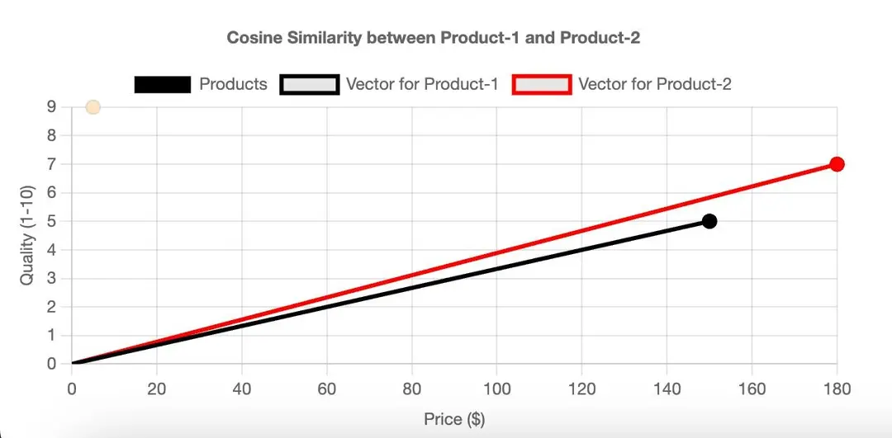

### Vector Semantic Search using MariaDB (Part 1/2)


#### Prologue 
I am a man of conservative by nature *not* by age. When it comes to experiments, I am rather proactive to new technology. The motto is we have to get merits and demerits of both ends so that an optimal solution can be orchestrated to the maximum extend. 

IMHO, both SQL and NoSQL databases have their roles in modern data processing. Currently, RDBMS dominates the market because-of it's popularity and ease-of-use. However, NoSQL database evinces tremendous flexibility in certain application scenario. It's the emerging menace of NoSQL which brings about new challenge and evolution to *traditional* SQL database. Examples are [JSON](https://www.w3schools.com/js/js_json_datatypes.asp) data types in which began in the early 2010s and VECTOR datatype in years of relatively recent. 


#### I. [What is HNSW?](https://towardsdatascience.com/similarity-search-part-4-hierarchical-navigable-small-world-hnsw-2aad4fe87d37/) (TL;DR)
> [Hierarchical Navigable Small World](https://arxiv.org/pdf/1603.09320.pdf) (HNSW) is a state-of-the-art algorithm used for an approximate search of nearest neighbours. Under the hood, HNSW constructs optimized graph structures making it very different from other approaches that were discussed in previous parts of this article series.

> The main idea of HNSW is to construct such a graph where a path between any pair of vertices could be traversed in a small number of steps.

> **Similarity search** is a problem where given a query the goal is to find the most similar documents to it among all the database documents. 

> In data science, similarity search often appears in the NLP domain, search engines or recommender systems where the most relevant documents or items need to be retrieved for a query. There exists a large variety of different ways to improve search performance in massive volumes of data.

The crucial data structures used inside the HNSW implementation are [Skip lists](https://en.wikipedia.org/wiki/Skip_list) and [Navigable Small World](https://en.wikipedia.org/wiki/Small-world_network). 

##### **Skip lists**
> [Skip list](https://en.wikipedia.org/wiki/Skip_list) is a [probabilistic data structure](https://www.sciencedirect.com/topics/computer-science/probabilistic-data-structure) that allows inserting and searching elements within a sorted list for *O(logn)* on average. 

> A probabilistic data structure is defined as a structure that allows the insertion of data and a check function, such as Bloom Filter (BF) and Cuckoo Filter (CF), which enable a rate of *false positives* but not *false negatives* by using hash functions to map elements and determine their presence with high probability.
- *False Positives*: This occurs when a test incorrectly indicates the presence of a condition (such as a disease) when it is not actually present. For example, a medical test might show that a person has a disease when they do not. This is also known as a "Type I error."
- *False Negatives*: This happens when a test fails to detect a condition that is actually present. For example, a medical test might show that a person does not have a disease when they actually do. This is also known as a "Type II error."

A skip list is constructed by several layers of linked lists. The lowest layer has the original linked list with all the elements in it. When moving to higher levels, the number of skipped elements increases, thus decreasing the number of connections.


> The search procedure for a certain value starts from the highest level and compares its next element with the value. If the value is less or equal to the element, then the algorithm proceeds to its next element. Otherwise, the search procedure descends to the lower layer with more connections and repeats the same process. At the end, the algorithm descends to the lowest layer and finds the desired node.

> Based on the information from [Wikipedia](https://en.wikipedia.org/wiki/Skip_list), a skip list has the main parameter *p* which defines the probability of an element appearing in several lists. If an element appears in layer *i*, then the probability that it will appear in layer *i + 1* is equal to *p* (*p* is usually set to 0.5 or 0.25). On average, each element is presented in *1 / (1 – p)* lists.

> As we can see, this process is much faster than the normal linear search in the linked list. In fact, HNSW inherits the same idea but instead of linked lists, it uses graphs.

##### **Navigable Small World**
> [Navigable small world](https://en.wikipedia.org/wiki/Small-world_network) is a graph with polylogarithmic *T = O(logᵏn)* search complexity which uses greedy routing. **Routing** refers to the process of starting the search process from low-degree vertices and ending with high-degree vertices. Since low-degree vertices have very few connections, the algorithm can rapidly move between them to efficiently navigate to the region where the nearest neighbour is likely to be located. Then the algorithm gradually zooms in and switches to high-degree vertices to find the nearest neighbour among the vertices in that region.

> Vertex is sometimes also referred to as a **node**.

###### **Search**
> In the first place, search is proceeded by choosing an entry point. To determine the next vertex (or vertices) to which the algorithm makes a move, it calculates the distances from the query vector to the current vertex’s neighbours and moves to the closest one. At some point, the algorithm terminates the search procedure when it cannot find a neighbour node that is closer to the query than the current node itself. This node is returned as the response to the query.


> Greedy search process in a navigable small world. Node A is used as an entry point. It has two neighbours B and D. Node D is closer to the query than B. As a result, we move to D. Node D has three neighbours C, E and F. E is the closest neighbour to the query, so we move to E. Finally, the search process will lead to node L. Since all neighbours of L are located further from the query than L itself, we stop the algorithm and return L as the answer to the query.

> This greedy strategy does not guarantee that it will find the exact nearest neighbour as the method uses only local information at the current step to take decisions. **Early stopping** is one of the problems of the algorithm. It occurs especially at the beginning of the search procedure when there are no better neighbour nodes than the current one. For the most part, this might happen when the starting region has too many low-degree vertices.


> Early stopping. Both neighbours of the current node are further away from the query. Thus, the algorithm returns the current node as the response, though there exist much closer nodes to the query.

> The search accuracy can be improved by using several entry points.

###### **Construction**
> The NSW graph is built by shuffling dataset points and inserting them one by one in the current graph. When a new node is inserted, it is then linked by edges to the *M* nearest vertices to it.


> Sequential insertion of nodes (from left to right) with M = 2. At each iteration, a new vertex is added to the graph and linked to its M = 2 nearest neighbours. Blue lines represent the connected edges to a newly inserted node.

> In most scenarios, long-range edges will likely be created at the beginning phase of the graph construction. They play an important role in graph navigation.

> From the example in the figure above, we can see the importance of the long-range edge *AB* that was added in the beginning. Imagine a query requiring the traverse of a path from the relatively far-located nodes *A* and *I*. Having the edge *AB* allows doing it rapidly by directly navigating from one side of the graph to the opposite one.

> As the number of vertices in the graph increases, it increases the probability that the lengths of newly connected edges to a new node will be smaller.

##### **HNSW**
> [HNSW](https://arxiv.org/pdf/1603.09320.pdf) is based on the same principles as skip list and navigable small world. Its structure represents a multi-layered graph with fewer connections on the top layers and more dense regions on the bottom layers.

###### **Search**
> The search starts from the highest layer and proceeds to one level below every time the local nearest neighbour is greedily found among the layer nodes. Ultimately, the found nearest neighbour on the lowest layer is the answer to the query.


> Similarly to NSW, the search quality of HNSW can be improved by using several entry points. Instead of finding only one nearest neighbour on each layer, the *efSearch* (a hyperparameter) __ closest nearest neighbours to the query vector are found and each of these neighbours is used as the entry point on the next layer.

###### **Complexity**
> The authors of the [original paper](https://arxiv.org/pdf/1603.09320.pdf) claim that the number of operations required to find the nearest neighbour on any layer is bounded by a constant. Taking into consideration that the number of all layers in a graph is logarithmic, we get the total search complexity which is *O(logn)*.

###### **Construction**
**Choosing the maximum layer**
> Nodes in HNSW are inserted sequentially one by one. Every node is randomly assigned an integer *l* indicating the maximum layer at which this node can present in the graph. For example, if *l = 1*, then the node can only be found on layers 0 and 1. The authors select *l* randomly for each node with an *exponentially decaying probability distribution* normalized by the non-zero multiplier *mL* (*mL* = 0 results in a single layer in HNSW and non-optimized search complexity). Normally, the majority of *l* values should be equal to 0, so most of the nodes are present only on the lowest level. The larger values of *mL* increase the probability of a node appearing on higher layers.

---
**Note from copilot**

An **exponentially decaying probability distribution** is a type of probability distribution where the probability of an event decreases exponentially as the event moves further away from a certain point. This is often used to model the time between events in a Poisson process, such as the time between arrivals at a service point or the time until the next failure of a machine.

The probability density function (PDF) of an exponentially decaying distribution is given by:

$$ f(x; \lambda) = \lambda e^{-\lambda x} $$

where:
- \( x \) is the variable (e.g., time),
- \( \lambda \) is the rate parameter, which is the inverse of the mean.

Some key properties of this distribution include:
- **Memorylessness**: The probability of an event occurring in the future is independent of the past.
- **Mean and Variance**: Both are equal to \( \frac{1}{\lambda} \).

---


> The number of layers l for every node is chosen randomly with exponentially decaying probability distribution.

> One of the ways to decrease the overlap is to decrease *mL*. But it is important to keep in mind that reducing *mL* also leads on average to more traversals during a greedy search on each layer. That is why it is essential to choose such a value of *mL* that will balance both the overlap and the number of traversals.

> The authors of the paper propose choosing the optimal value of *mL* which is equal to *1 / ln(M)*. This value corresponds to the parameter *p = 1 / M* of the skip list being an average single element overlap between the layers.

###### **Insertion**
> After a node is assigned the value *l*, there are two phases of its insertion:

1. The algorithm starts from the upper layer and greedily finds the nearest node. The found node is then used as an entry point to the next layer and the search process continues. Once the layer *l* is reached, the insertion proceeds to the second step.
2. Starting from layer *l* the algorithm inserts the new node at the current layer. Then it acts the same as before at step 1 but instead of finding only one nearest neighbour, it greedily searches for *efConstruction* (hyperparameter) nearest neighbours. Then *M* out of *efConstruction* neighbours are chosen and edges from the inserted node to them are built. After that, the algorithm descends to the next layer and each of found *efConstruction* nodes acts as an entry point. The algorithm terminates after the new node and its edges are inserted on the lowest layer 0.


> Insertion of a node (in blue) in HNSW. The maximum layer for a new node was randomly chosen as l = 2. Therefore, the node will be inserted on layers 2, 1 and 0. On each of these layers, the node will be connected to its M = 2 nearest neighbours.

###### **Choosing values for construction parameters**
> The original paper provides several useful insights on how to choose hyperparameters:

- According to simulations, good values for *M* lie between 5 and 48. Smaller values of *M* tend to be better for lower [recalls](https://milvus.io/ai-quick-reference/what-is-recall-in-the-context-of-vector-search-results-and-how-is-recall-typically-calculated-when-evaluating-an-ann-algorithm-against-groundtruth-neighbors) or low-dimensional data while higher values of *M* are suited better for high recalls or high-dimensional data.
- Higher values of *efConstruction* imply a more profound search as more candidates are explored. However, it requires more computations. Authors recommend choosing such an *efConstruction* value that results at recall being close to 0.95–1 during training.
- Additionally, there is another important parameter *Mₘₐₓ* – the maximum number of edges a vertex can have. Apart from it, there exists the same parameter *Mₘₐₓ₀* but separately for the lowest layer. It is recommended to choose a value for *Mₘₐₓ* close to *2 * M*. Values greater than *2 * M* can lead to performance degradation and excessive memory usage. At the same time, *Mₘₐₓ = M* results in poor performance at high recall.

**Note**

In vector search, recall measures how well an approximate nearest neighbor (ANN) algorithm retrieves the true closest matches (ground-truth neighbors) for a query.

###### **Candidate selection heuristic**
> It was noted above that during node insertion, *M* out of *efConstruction* candidates are chosen to build edges to them. Let us discuss possible ways of choosing these *M* nodes.

> The naïve approach takes *M* closest candidates. Nevertheless, it is not always the optimal choice. Below is an example demonstrating it.

> Imagine a graph with the structure in the figure below. As you can see, there are three regions with two of them not being connected to each other (on the left and on the top). As a result, getting, for example, from point *A* to *B* requires a long path through another region. It would be logical to somehow connect these two regions for better navigation.


> Node X is inserted into the graph. The objective is to optimally connect it to other M = 2 points.

> Then a node X is inserted into the graph and needs to be linked to *M = 2* other __ vertices.

> In this case, the naïve approach directly takes the *M = 2* nearest neighbours (*B* and *C*) and connects *X* to them. Though *X* is connected to its real nearest neighbours, it does not solve the problem. Let us look at the heuristical approach invented by the authors.

> The heuristic considers not only the closest distances between nodes but also the connectivity of different regions on the graph.

> The heuristic chooses the first nearest neighbour (*B* in our case) and connects the inserted node (*X*) to it. Then the algorithm sequentially takes another most closest nearest neighbour in the sorted order (*C*) and builds an edge to it only if the distance from this neighbour to the new node (*X*) is smaller than any distance from this neighbour to all already connected vertices (*B*) to the new node (*X*). After that, the algorithm proceeds to the next closest neighbour until *M* edges are built.

> Getting back to the example, the heuristical procedure is illustrated in the figure below. The heuristic chooses *B* as the closest nearest neighbour for X and builds the edge *BX*. Then the algorithm chooses C as the next closest nearest neighbour. However, this time *BC < CX*. This indicates that adding the edge *CX* to the graph is not optimal because there already exists the edge *BX* and the nodes *B* and *C* are very close to each other. The same analogy proceeds with the nodes *D* and *E*. After that, the algorithm examines the node *A*. This time, it satisfies the condition since *BA > AX*. As a result, the new edge *AX* and both initial regions become connected to each other.


> The example on the left uses the naïve approach. The example on the right uses the selection heuristic which results in two initial disjoint regions being connected to each other.

###### **Complexity**
> The insertion process works very similarly, compared to the search procedure, without any significant differences which could require a non-constant number of operations. Thus, the insertion of a single vertex imposes *O(logn)* of time. To estimate the total complexity, the number of all inserted nodes *n* in a given dataset should be considered. Ultimately, HNSW construction requires *O(n * logn)* time.

---
- *efSearch*: number of nearest neighbours to explore in running the query; 
- *efConstruction*: number of nearest neighbours are chosen to built edges from the inserted node; 
- *M*: number of linked edges to the nearest neighbours.


#### II. [MariaDB Vectors (MariaDB.org)](https://mariadb.org/projects/mariadb-vector)
- A project guided by the MariaDB Foundation, built with the MariaDB Server community. Main contributors – MariaDB Corporation, MariaDB Foundation, Amazon
- Enables fast vector search in a relational database.
- Keep your technology stack simple, no need for specialised datastores.

> There is a dedicated VECTOR data type and a specialized VECTOR index type. The indexing algorithm is a modified version of HNSW.
```
CREATE TABLE products (
    name varchar(128),
    description varchar(2000),
    embedding VECTOR(4) NOT NULL,  # Make sure the dimensions match your AI model's output
    VECTOR INDEX (embedding) M=6 DISTANCE=euclidean)
ENGINE=InnoDB;
```

Vector distance functions:
```
# Euclidean distance
VEC_DISTANCE_EUCLIDEAN(embedding, Vec_FromText('[0.1, 0.4, 0.5, 0.3, 0.2]'))
```

Utility vector functions:
```
VEC_FromText('[...]')  # JSON array of floats.
VEC_ToText(<vector-bytes>)
```

Insert vectors:
```
INSERT INTO products (name, description, embedding)
VALUES ('Coffee Machine',
        'Built to make the best coffee you can imagine',
        VEC_FromText('[0.3, 0.5, 0.2, 0.1]'))
```

Vector search:
```
SELECT p.name, p.description
FROM products AS p
ORDER BY VEC_DISTANCE_EUCLIDEAN(p.embedding,
                      VEC_FromText('[0.3, 0,5, 0.1, 0.3]'))
LIMIT 10
```

> The MariaDB optimizer is tuned to leverage the vector index if the SELECT query has an `ORDER BY` `VEC_DISTANC_EUCLIDEAN` (or `VEC_DISTANC_COSINE`) clause and a `LIMIT` clause.

> MariaDB Vector preview implements a modified version of Hierarchical Navigable Small Worlds ([HNSW](https://arxiv.org/ftp/arxiv/papers/1603/1603.09320.pdf)) algorithm. The search performance is comparable with other vector search implementations and surpasses in scalability when multiple connections are used.


---
**Note from copilot**

When recall is on the x-axis and queries per second (QPS) is on the y-axis, the graph typically indicates the relationship between the accuracy of a search or retrieval system and its performance in terms of speed. The recall values are:0.9, 0.99, 0.999 and 0.9999 here. 

- **Recall**: Measures the proportion of relevant items that are successfully retrieved. Higher recall means more relevant items are found.
- **Queries Per Second (QPS)**: Indicates the number of queries the system can handle per second. Higher QPS means the system can process more queries in a given time.

- **High Recall, Low QPS**: The system is accurate but slower, possibly due to more complex or thorough search algorithms.
- **Low Recall, High QPS**: The system is faster but less accurate, possibly due to simpler or less thorough search algorithms.
- **Balanced Recall and QPS**: The system maintains a good balance between accuracy and speed.

This graph helps in understanding the trade-offs between the accuracy of the search results and the performance of the system. It can be useful for optimizing search algorithms to achieve the desired balance based on specific requirements.

---

A full benchmark set is available at:
[How Fast Is MariaDB Vector?](https://mariadb.com/resources/blog/how-fast-is-mariadb-vector/)


#### III. [MariaDB Vectors (MariaDB.com)](https://mariadb.com/kb/en/vectors/)
##### [Vector Overview](https://mariadb.com/kb/en/vector-overview/)
MariaDB Vector is a feature that allows MariaDB Server to perform as a relational vector database. Vectors generated by your favourite AI model can be stored and searched for in MariaDB.

The initial implementation uses the modified HNSW algorithm for searching in the vector index (to solve the so-called Approximate Nearest Neighbor problem), and defaults to Euclidean distance. Concurrent reads/writes and all [transaction isolation levels](https://mariadb.com/kb/en/set-transaction/#isolation-level) are supported.

MariaDB uses int16 for indexes, which gives 15 bits to store the value, rather than 10 bits for float16.

**Creating**
> Vectors can be defined using VECTOR INDEX for the index definition, and using the [VECTOR data type](https://mariadb.com/kb/en/vector/) in the [CREATE TABLE](https://mariadb.com/kb/en/create-table-with-vectors/) statement.
```
CREATE TABLE v (
     id INT PRIMARY KEY,
     v VECTOR(5) NOT NULL,
     VECTOR INDEX (v)
);
```

The distance function used to build the vector index can be `euclidean` (the default), or `cosine`. An additional option, `M`, can also be used to configure the vector index. Larger values mean slower SELECTs and INSERTs, larger index size and higher memory consumption but more accurate results. The valid range is from 3 to 200.
```
CREATE TABLE embeddings (
        doc_id BIGINT UNSIGNED PRIMARY KEY,
        embedding VECTOR(1536) NOT NULL,
        VECTOR INDEX (embedding) M=8 DISTANCE=cosine
);
```

**Inserting**
> Vector columns store [32-bit IEEE 754 floating point numbers](https://en.wikipedia.org/wiki/Single-precision_floating-point_format).
```
INSERT INTO v VALUES 
     (1, x'e360d63ebe554f3fcdbc523f4522193f5236083d'),
     (2, x'f511303f72224a3fdd05fe3eb22a133ffae86a3f'),
     (3,x'f09baa3ea172763f123def3e0c7fe53e288bf33e'),
     (4,x'b97a523f2a193e3eb4f62e3f2d23583e9dd60d3f'),
     (5,x'f7c5df3e984b2b3e65e59d3d7376db3eac63773e'),
     (6,x'de01453ffa486d3f10aa4d3fdd66813c71cb163f'),
     (7,x'76edfc3e4b57243f10f8423fb158713f020bda3e'),
     (8,x'56926c3fdf098d3e2c8c5e3d1ad4953daa9d0b3e'),
     (9,x'7b713f3e5258323f80d1113d673b2b3f66e3583f'),
     (10,x'6ca1d43e9df91b3fe580da3e1c247d3f147cf33e');
```

Alternatively one can use `VEC_FromText()` function:
```
INSERT INTO v VALUES
  (1,Vec_FromText('[0.418708,0.809902,0.823193,0.598179,0.0332549]')),
  (2,Vec_FromText('[0.687774,0.789588,0.496138,0.57487,0.917617]')),
  (3,Vec_FromText('[0.333221,0.962687,0.467263,0.448235,0.475671]')),
  (4,Vec_FromText('[0.822185,0.185643,0.683452,0.211072,0.554056]')),
  (5,Vec_FromText('[0.437057,0.167281,0.0770977,0.428638,0.241591]')),
  (6,Vec_FromText('[0.76956,0.926895,0.803376,0.0157961,0.589042]')),
  (7,Vec_FromText('[0.493999,0.641957,0.761598,0.94276,0.425865]')),
  (8,Vec_FromText('[0.924108,0.275466,0.0543329,0.0731585,0.136344]')),
  (9,Vec_FromText('[0.186956,0.69666,0.0356002,0.668875,0.84722]')),
  (10,Vec_FromText('[0.415294,0.609278,0.426765,0.988832,0.475556]'));
```

**Querying**
> For vector indexes built with the `euclidean` function, [VEC_DISTANCE_EUCLIDEAN](https://mariadb.com/kb/en/vec_distance_euclidean/) can be used. It calculates a Euclidean (L2) distance between two points.
```
SELECT id FROM v ORDER BY 
  VEC_DISTANCE_EUCLIDEAN(v, x'6ca1d43e9df91b3fe580da3e1c247d3f147cf33e');
+----+
| id |
+----+
| 10 |
|  7 |
|  3 |
|  9 |
|  2 |
|  1 |
|  5 |
|  4 |
|  6 |
|  8 |
+----+
```

Most commonly, this kind of query is done with a limit, for example to return vectors that are closest to a given vector, such as from a user search query, image or a song fragment.
```
SELECT id FROM v 
  ORDER BY VEC_DISTANCE_EUCLIDEAN(v, x'6ca1d43e9df91b3fe580da3e1c247d3f147cf33e') LIMIT 2;
+----+
| id |
+----+
| 10 |
|  7 |
+----+
```

> For vector indexes built with the `cosine` function, [VEC_DISTANCE_COSINE](https://mariadb.com/kb/en/vec_distance_cosine/) can be used. It calculates a [Cosine distance](https://en.wikipedia.org/wiki/Cosine_similarity#Cosine_distance) between two vectors
```
SELECT VEC_DISTANCE_COSINE(VEC_FROMTEXT('[1,2,3]'), VEC_FROMTEXT('[3,5,7]'));
```

> The [VEC_DISTANCE](https://mariadb.com/kb/en/vector-functions-vec_distance/) function is a generic function that behaves either as [VEC_DISTANCE_EUCLIDEAN](https://mariadb.com/kb/en/vec_distance_euclidean/) or [VEC_DISTANCE_COSINE](https://mariadb.com/kb/en/vec_distance_cosine/), depending on the underlying index type.
```
SELECT id FROM v 
  ORDER BY VEC_DISTANCE(v, x'6ca1d43e9df91b3fe580da3e1c247d3f147cf33e');
+----+
| id |
+----+
| 10 |
|  7 |
|  3 |
|  9 |
|  2 |
|  1 |
|  5 |
|  4 |
|  6 |
|  8 |
+----+
```

**System Variables**
> There are a number of system variables used for vectors. See [Vector System Variables](https://mariadb.com/kb/en/vector-system-variables/).

**Vector Framework Integrations**
> MariaDB Vector is integrated in several frameworks, see [Vector Framework Integrations](https://mariadb.com/kb/en/vector-framework-integrations/).

**See Also**
- [Get to know MariaDB’s Rocket-Fast Native Vector Search - Sergei Golubchyk](https://www.youtube.com/watch?v=gNyzcy_6qJM) (video)
- [MariaDB Vector, a new Open Source vector database that you are already familiar by Sergei Golubchik](https://www.youtube.com/watch?v=r9af4bvF7jI) (video)
- [AI first applications with MariaDB Vector - Vicentiu Ciorbaru](https://www.youtube.com/watch?v=vp126N1QOws) (video)
- [MariaDB Vector: A storage engine for LLMs - Kaj Arnö and Jonah Harris](https://www.youtube.com/watch?v=3y-yWoH-CF8) (video)
- [Try RAG with MariaDB Vector on your own MariaDB data!](https://mariadb.org/rag-with-mariadb-vector/)

##### [CREATE TABLE with Vectors](https://mariadb.com/kb/en/create-table-with-vectors/)
> MariaDB has a dedicated [VECTOR(N)](https://mariadb.com/kb/en/vector/) data type with a built-in data validation. N is the number of dimensions that all vector values in the column will have. For example,
```
CREATE TABLE embeddings (
        doc_id BIGINT UNSIGNED PRIMARY KEY,
        embedding VECTOR(1536)
);
```

> To have a fast vector search one needs to index the vector column, creating a `VECTOR` index:
```
CREATE TABLE embeddings (
        doc_id BIGINT UNSIGNED PRIMARY KEY,
        embedding VECTOR(1536) NOT NULL,
        VECTOR INDEX (embedding)
);
```

> Note that there can be only one vector index in the table and the indexed vector column must be `NOT NULL`.

> There are two options that can be used to configure the vector index.

- `M` — Larger values mean slower SELECTs and INSERTs, larger index size and higher memory consumption but more accurate results. The valid range is from `3` to `200`.
- `DISTANCE` — Distance function to build the vector index for. Searches using a different distance function will not be able to use a vector index. Valid values are `cosine` and `euclidean` (the default). For example,
```
CREATE TABLE embeddings (
        doc_id BIGINT UNSIGNED PRIMARY KEY,
        embedding VECTOR(1536) NOT NULL,
        VECTOR INDEX (embedding) M=8 DISTANCE=cosine
);
```

##### [Vector System Variables](https://mariadb.com/kb/en/vector-system-variables/)
> This page documents system variables related to [Vectors](https://mariadb.com/kb/en/vectors/).

> See [Server System Variables](https://mariadb.com/kb/en/server-system-variables/) for a complete list of system variables and instructions on setting them.

> Also see the [Full list of MariaDB options, system and status variables](https://mariadb.com/kb/en/full-list-of-mariadb-options-system-and-status-variables/).

mhnsw_default_distance
- **Description**: Specifies the default distance metric for MHNSW vector indexing. This is used when the `DISTANCE` option is not explicitly defined during index creation.
- **Commandline**: `--mhnsw-default-distance=val`
- **Scope**: Global, Session
- **Dynamic**: Yes
- **Data Type**: `enum`
- **Default Value**: `euclidean`
- **Valid Values**:
1. `euclidean` Calculates straight-line distance between vectors. Best for spatial data, images, etc, when absolute magnitude matters.
2. `cosine` Measures directional similarity between vectors. Ideal for text embeddings, semantic search, and when vector magnitude is less important.
**Introduced**: [MariaDB 11.7.1](https://mariadb.com/kb/en/mariadb-11-7-1-release-notes/)

mhnsw_default_m
- **Description**: Defines the default value for the M parameter in MHNSW vector indexing. The `M` parameter controls the number of connections per layer in the graph structure, influencing the balance between search performance and index size.
1. Larger `M` → Better search accuracy, but larger index size and slower updates and searches.
2. Smaller `M` → Faster updates and searches, smaller index, but potentially less accurate search.
- **Commandline**: `--mhnsw-default-m=#`
- **Scope**: Global, Session
- **Dynamic**: Yes
- **Data Type**: `int unsigned`
- **Default** Value: `6`
- **Range**: `3` to `200`
- **Introduced**: [MariaDB 11.7.1](https://mariadb.com/kb/en/mariadb-11-7-1-release-notes/)

mhnsw_ef_search
- **Description**: Defines the minimal number of result candidates to look for in the vector index for ORDER BY ... LIMIT N queries. The search will never search for less rows than that, even if LIMIT is smaller. This notably improves the search quality at low LIMIT values, at the expense of search time. Higher values may increase search quality but will also impact query performance.
- **Commandline**: `--mhnsw-ef-search=#`
- **Scope**: Global, Session
- **Dynamic**: Yes
- **Data Type**: `int unsigned`
- **Default Value**: `20`
- **Range**: `1` to `10000`
- **Introduced**: [MariaDB 11.7.1](https://mariadb.com/kb/en/mariadb-11-7-1-release-notes/)

mhnsw_max_cache_size
- **Description**: Upper limit for one MHNSW vector index cache. This limits the amount of memory that can be used for caching the index, ensuring efficient memory utilization.
- **Commandline**: `--mhnsw-max-cache-size=#`
- **Scope**: Global
- ***Dynamic***: Yes
- **Data Type**: `bigint unsigned`
- **Default Value**: `16777216` (16 MB)
- **Range**: `1048576` to `18446744073709551615`
- **Introduced**: [MariaDB 11.7.1](https://mariadb.com/kb/en/mariadb-11-7-1-release-notes/)

##### [Vector Functions](https://mariadb.com/kb/en/vector-functions/)
1. [VEC_DISTANCE](https://mariadb.com/kb/en/vector-functions-vec_distance/): `VEC_DISTANCE` is a generic function that will behave either as [VEC_DISTANCE_EUCLIDEAN](https://mariadb.com/kb/en/vec_distance_euclidean/), calculating the Euclidean (L2) distance between two points. or [VEC_DISTANCE_COSINE](https://mariadb.com/kb/en/vec_distance_cosine/), calculating the Cosine distance between two vectors, depending on the underlying index type. If the underlying index cannot be determined, an [error 4206](https://mariadb.com/kb/en/e4206/) is returned:

2. [VEC_DISTANCE_COSINE](https://mariadb.com/kb/en/vec_distance_cosine/): `VEC_Distance_Cosine` is an SQL function that calculates a [Cosine distance](https://en.wikipedia.org/wiki/Cosine_similarity#Cosine_distance) between two vectors. If the vector index was not built for the cosine function (see [CREATE TABLE with Vectors](https://mariadb.com/kb/en/create-table-with-vectors/)), the index will not be used, and a full table scan performed instead. The [VEC_DISTANCE](https://mariadb.com/kb/en/vector-functions-vec_distance/) function is a generic function that behaves either as [VEC_DISTANCE_EUCLIDEAN](https://mariadb.com/kb/en/vec_distance_euclidean/) or VEC_DISTANCE_COSINE, depending on the underlying index type.

3. [VEC_DISTANCE_EUCLIDEAN](https://mariadb.com/kb/en/vec_distance_euclidean/): `VEC_Distance_Euclidean` is an SQL function that calculates a Euclidean (L2) distance between two points. If the vector index was not built for the euclidean function (see [CREATE TABLE with Vectors](https://mariadb.com/kb/en/create-table-with-vectors/)), the index will not be used, and a full table scan performed instead. The [VEC_DISTANCE](https://mariadb.com/kb/en/vector-functions-vec_distance/) function is a generic function that behaves either as VEC_DISTANCE_EUCLIDEAN or [VEC_DISTANCE_COSINE](https://mariadb.com/kb/en/vec_distance_cosine/), depending on the underlying index type.

4. [VEC_FromText](https://mariadb.com/kb/en/vec_fromtext/): `VEC_FromText` converts a text representation of the vector (json array of numbers) to a vector (little-endian IEEE float sequence of bytes, 4 bytes per float).

5. [VEC_ToText](https://mariadb.com/kb/en/vec_totext/): `VEC_ToText` converts a binary vector into a json array of numbers (floats). Returns NULL and throws a warning [4201](https://mariadb.com/kb/en/e4201/) if given an invalid vector.

##### [VECTOR](https://mariadb.com/kb/en/vector/)
> The VECTOR data type was added as part of the [vectors](https://mariadb.com/kb/en/vectors/) feature, which permits MariaDB Server to perform as a relational vector database.


##### [Vector Framework Integrations](https://mariadb.com/kb/en/vector-framework-integrations/)
**AI framework integrations**
- [LangChain, MariaDB Vector Store](https://pypi.org/project/langchain-mariadb/) - python
- [LangChain.js, MariaDB Vector Store](https://js.langchain.com/docs/integrations/vectorstores/mariadb/) - node.js
- [LangChain4j, MariaDB Embedding Store](https://docs.langchain4j.dev/integrations/embedding-stores/mariadb/) - java
- [LlamaIndex, MariaDB Vector Store](https://docs.llamaindex.ai/en/stable/api_reference/storage/vector_store/mariadb/) - python
- [Spring AI, MariaDB Vector Store](https://docs.spring.io/spring-ai/reference/api/vectordbs/mariadb.html) - java
- [VectorDBBench](https://github.com/zilliztech/VectorDBBench/pull/375) - benchmarking for vector databases

**Potential future integrations**
- [AutoGen](https://github.com/microsoft/autogen) - agent to agent
- [DSPy](https://github.com/stanfordnlp/dspy) - workflow
- [Feast](https://github.com/feast-dev/feast) - machine learning (not GenAI)
- [LangGraph](https://github.com/langchain-ai/langgraph) - agentic workflow
- [MCP (Model Context Protocol)](https://github.com/modelcontextprotocol) - integration to external data sources and tools
- [Open WebUI](https://github.com/open-webui/open-webui) - AI Interface
- [Google IDX template for MariaDB](https://idx.uservoice.com/forums/953956-general/suggestions/49702310-mariadb-vector) - visit link to vote for suggestion


#### IV. Limitations 


#### V. [Redis Vectors](https://redis.io/docs/latest/develop/interact/search-and-query/advanced-concepts/vectors/)

Redis includes a [high-performance vector database](https://redis.io/blog/benchmarking-results-for-vector-databases/) that lets you perform semantic searches over vector embeddings. You can augment these searches with filtering over text, numerical, geospatial, and tag metadata.

##### **Create a vector index**

```
FT.CREATE <index_name>
  ON <storage_type>
  PREFIX 1 <key_prefix>
  SCHEMA ... <field_name> VECTOR <algorithm> <index_attribute_count> <index_attribute_name> <index_attribute_value>
    [<index_attribute_name> <index_attribute_value> ...]
```

| Parameter | Description |
| ----------- | ----------- |
| index_name | Name of the index. | 
| storage_type | Storage option (HASH or JSON). | 
| prefix (optional) | Key prefix used to select which keys should be indexed. Defaults to all keys if omitted. | 
| field_name | Name of the vector field. | 
| algorithm | Vector index algorithm (FLAT or HNSW). |
| index_attribute_count | Number of vector field attributes. |
| index_attribute_name | Vector field attribute name.. |
| index_attribute_value | Vector field attribute value. |

##### **FLAT INDEX**

> Choose the FLAT index when you have small datasets (< 1M vectors) or when perfect search accuracy is more important than search latency.

| Attribute | Description |
| ----------- | ----------- |
| TYPE | Vector type (BFLOAT16, FLOAT16, FLOAT32, FLOAT64). BFLOAT16 and FLOAT16 require v2.10 or later. |
| DIM | The width, or number of dimensions, of the vector embeddings stored in this field. In other words, the number of floating point elements comprising the vector. DIM must be a positive integer. The vector used to query this field must have the exact dimensions as the field itself. |
| DISTANCE_METRIC | Distance metric (L2, IP, COSINE). |

```
FT.CREATE documents
  ON HASH
  PREFIX 1 docs:
  SCHEMA doc_embedding VECTOR FLAT 6
    TYPE FLOAT32
    DIM 1536
    DISTANCE_METRIC COSINE
```

> In the example above, an index named documents is created over hashes with the key prefix docs: and a FLAT vector field named doc_embedding with three index attributes: TYPE, DIM, and DISTANCE_METRIC.

##### **HNSW index**

> HNSW, or hierarchical navigable small world, is an approximate nearest neighbors algorithm that uses a multi-layered graph to make vector search more scalable.

- The lowest layer contains all data points, and each higher layer contains a subset, forming a hierarchy.

- At runtime, the search traverses the graph on each layer from top to bottom, finding the local minima before dropping to the subsequent layer.

> Choose the HNSW index type when you have larger datasets (> 1M documents) or when search performance and scalability are more important than perfect search accuracy.

| Attribute | Description |
| ----------- | ----------- |
| TYPE | Vector type (BFLOAT16, FLOAT16, FLOAT32, FLOAT64). BFLOAT16 and FLOAT16 require v2.10 or later. |
| DIM | The width, or number of dimensions, of the vector embeddings stored in this field. In other words, the number of floating point elements comprising the vector. DIM must be a positive integer. The vector used to query this field must have the exact dimensions as the field itself. |
| DISTANCE_METRIC	 | Distance metric (L2, IP, COSINE). |

*Optional attributes*

> [HNSW](https://arxiv.org/ftp/arxiv/papers/1603/1603.09320.pdf) supports a number of additional parameters to tune the accuracy of the queries, while trading off performance.

| Attribute | Description |
| ----------- | ----------- |
| M | Max number of outgoing edges (connections) for each node in a graph layer. On layer zero, the max number of connections will be 2 * M. Higher values increase accuracy, but also increase memory usage and index build time. The default is 16. |
| EF_CONSTRUCTION | Max number of connected neighbors to consider during graph building. Higher values increase accuracy, but also increase index build time. The default is 200. |
| EF_RUNTIME | Max top candidates during KNN search. Higher values increase accuracy, but also increase search latency. The default is 10. |
| EPSILON | Relative factor that sets the boundaries in which a range query may search for candidates. That is, vector candidates whose distance from the query vector is radius * (1 + EPSILON) are potentially scanned, allowing more extensive search and more accurate results, at the expense of run time. The default is 0.01. |

```
FT.CREATE documents
  ON HASH
  PREFIX 1 docs:
  SCHEMA doc_embedding VECTOR HNSW 10
    TYPE FLOAT64
    DIM 1536
    DISTANCE_METRIC COSINE
    M 40
    EF_CONSTRUCTION 250
```

> In the example above, an index named documents is created over hashes with the key prefix docs: and an HNSW vector field named doc_embedding with five index attributes: TYPE, DIM, DISTANCE_METRIC, M, and EF_CONSTRUCTION.

##### **Distance metrics**

> Redis supports three popular distance metrics to measure the degree of similarity between two vectors u, v; where n is the length of the vectors:.


> The above metrics calculate distance between two vectors, where the smaller the value is, the closer the two vectors are in the vector space.

- **Euclidean Distance (L2 norm)** calculates the linear distance between two points within a multi-dimensional space. Lower values indicate closer proximity, and hence higher similarity. For illustration purposes, let's assess `product 1 `and `product 2` from the earlier ecommerce dataset and determine the `Euclidean Distance` considering all features. 


- **Inner Product** (dot product) The inner product (or dot product) isn't a distance metric in the traditional sense but can be used to calculate similarity, especially when vectors are normalized (have a magnitude of 1). It's the sum of the products of the corresponding entries of the two sequences of numbers. The inner product can be thought of as a measure of how much two vectors "align" in a given vector space. Higher values indicate higher similarity. However, the raw values can be large for long vectors; hence, normalization is recommended for better interpretation. If the vectors are normalized, their dot product will be 1 if they are identical and 0 if they are orthogonal (uncorrelated).

- **Cosine Similarity** measures the cosine of the angle between two vectors. The cosine similarity value ranges between -1 and 1. A value closer to 1 implies a smaller angle and higher similarity, while a value closer to -1 implies a larger angle and lower similarity. Cosine similarity is particularly popular in NLP when dealing with text vectors. If two vectors are pointing in the same direction, the cosine of the angle between them is 1. If they're orthogonal, the cosine is 0, and if they're pointing in opposite directions, the cosine is -1.


##### **Hash**

> Store or update vectors and any metadata in hashes using the HSET command.

```
HSET docs:01 doc_embedding <vector_bytes> category sports
```

> Hash values are stored as binary-safe strings. The value <vector_bytes> represents the vector's underlying memory buffer.

> The vector blob size must match the dimension and float type of the vector field specified in the index's schema; otherwise, indexing will fail.

##### **JSON**

> To store vectors in Redis as JSON, you store the vector as a JSON array of floats. Note that this differs from vector storage in Redis hashes, which are instead stored as raw bytes.

```
JSON.SET docs:01 $ '{"doc_embedding":[0.34,0.63,-0.54,-0.69,0.98,0.61], "category": "sports"}'
```
> One of the benefits of JSON is schema flexibility. As of v2.6.1, JSON supports multi-value indexing. This allows you to index multiple vectors under the same [JSONPath](https://redis.io/docs/latest/develop/data-types/json/path/).

> You can run vector search queries with the [FT.SEARCH](https://redis.io/docs/latest//commands/ft.search/) or [FT.AGGREGATE](https://redis.io/docs/latest//commands/ft.aggregate/) commands.

> To issue a vector search query with FT.SEARCH, you must set the DIALECT option to >= 2. See the [dialects documentation](https://redis.io/docs/latest/develop/interact/search-and-query/advanced-concepts/dialects/) for more information.

##### **KNN vector search**

> KNN vector search finds the top k nearest neighbors to a query vector. It has the following syntax:
```
FT.SEARCH <index_name>
  <primary_filter_query>=>[KNN <top_k> @<vector_field> $<vector_blob_param> $<vector_query_params> AS <distance_field>]
  PARAMS <query_params_count> [$<vector_blob_param> <vector_blob> <query_param_name> <query_param_value> ...]
  SORTBY <distance_field>
  DIALECT 4
```

| Parameter | Description |
| ----------- | ----------- |
| index_name | Name of the index. |
| primary_filter_query | [Filter](https://redis.io/docs/latest//develop/interact/search-and-query/advanced-concepts/vectors#filters) criteria. Use * when no filters are required. |
| top_k | Number of nearest neighbors to fetch from the index. |
| vector_field | Name of the vector field to search against. |
| vector_blob_param | The query vector, passed in as a blob of raw bytes. The blob's byte size must match the vector field's dimensions and type. |
| vector_query_params (optional) | An optional section for marking one or more vector query parameters passed through the PARAMS section. Valid parameters should be provided as key-value pairs. See which [runtime query params](https://redis.io/docs/latest//develop/interact/search-and-query/advanced-concepts/vectors#runtime-query-params) are supported for each vector index type. |
| distance_field (optional) | The optional distance field name used in the response and/or for sorting. By default, the distance field name is __<vector_field>_score and it can be used for sorting without using AS <distance_field> in the query. |
| vector_query_params_count	 | The number of vector query parameters. |
| vector_query_param_name | The name of the vector query parameter. |
| vector_query_param_value | The value of the vector query parameter. |

```
FT.SEARCH documents "*=>[KNN 10 @doc_embedding $BLOB]" PARAMS 2 BLOB "\x12\xa9\xf5\x6c" DIALECT 4
```

> Alternatively, as of v2.6, <vector_query_params> and <distance_field> name can be specified in runtime [query attributes](https://redis.io/docs/latest/develop/interact/search-and-query/advanced-concepts/query_syntax/#query-attributes) as shown below.
```
[KNN <top_k> @<vector_field> $<vector_blob_param>]=>{$yield_distance_as: <distance_field>}
```

##### **Vector range queries**

> Vector range queries allow you to filter the index using a radius parameter representing the semantic distance between an input query vector and indexed vector fields. This is useful in scenarios when you don't know exactly how many nearest (top_k) neighbors to fetch, but you do know how similar the results should be.

> For example, imagine a fraud or anomaly detection scenario where you aren't sure if there are any matches in the vector index. You can issue a vector range query to quickly check if there are any records of interest in the index within the specified radius.

> Vector range queries operate slightly different than KNN vector queries:

- Vector range queries can appear multiple times in a query as filter criteria.

- Vector range queries can be a part of the <primary_filter_query> in KNN vector search.

```
FT.SEARCH <index_name>
  @<vector_field>:[VECTOR_RANGE (<radius> | $<radius_param>) $<vector_blob_param> $<vector_query_params>]
  PARAMS <vector_query_params_count> [<vector_query_param_name> <vector_query_param_value> ...]
  SORTBY <distance_field>
  DIALECT 4
```

| Parameter | Description |
| ----------- | ----------- |
| index_name | Name of the index. |
| vector_field | Name of the vector field in the index. |
| radius or radius_param | The maximum semantic distance allowed between the query vector and indexed vectors. You can provide the value directly in the query, passed to the PARAMS section, or as a query attribute. |
| vector_blob_param | The query vector, passed in as a blob of raw bytes. The blob's byte size must match the vector field's dimensions and type. |
| vector_query_params (optional) | An optional section for marking one or more vector query parameters passed through the PARAMS section. Valid parameters should be provided as key-value pairs. See which runtime query params are supported for each vector index type. |
| vector_query_params_count | The number of vector query parameters. |
| vector_query_param_name | The name of the vector query parameter. |
| vector_query_param_value | The value of the vector query parameter. |

> A vector range query clause can be followed by a query attributes section as follows:

```
@<vector_field>: [VECTOR_RANGE (<radius> | $<radius_param>) $<vector_blob_param>]=>{$<param>: (<value> |
    $<value_attribute>); ... }
```

> where the relevant parameters in that case are $yield_distance_as and $epsilon. Note that there is no default distance field name in range queries.

##### **Filters**

> Redis supports vector searches that include filters to narrow the search space based on defined criteria. If your index contains searchable fields (for example, TEXT, TAG, NUMERIC, GEO, GEOSHAPE, and VECTOR), you can perform vector searches with filters.

- [Exact match](https://redis.io/docs/develop/interact/search-and-query/query/exact-match/)

- [Numeric range](https://redis.io/docs/develop/interact/search-and-query/query/range/)

- [Full-text](https://redis.io/docs/develop/interact/search-and-query/query/full-text/)

- [Geospatial](https://redis.io/docs/develop/interact/search-and-query/query/geo-spatial/)

> You can also [combine multiple queries](https://redis.io/docs/develop/interact/search-and-query/query/combined/) as a filter.

> Vector search queries with filters follow this basic structure:

```
FT.SEARCH <index_name> <primary_filter_query>=>[...]
```

> where <primary_filter_query> defines document selection and filtering.

```
FT.SEARCH documents "(@title:Sports @year:[2020 2022])=>[KNN 10 @doc_embedding $BLOB]" PARAMS 2 BLOB "\x12\xa9\xf5\x6c" DIALECT 4
```

##### **How filtering works**

> Redis uses internal algorithms to optimize the filtering computation for vector search. The runtime algorithm is determined by heuristics that aim to minimize query latency based on several factors derived from the query and the index.

**Batches mode**

> Batches mode works by paginating through small batches of nearest neighbors from the index:

- A batch of high-scoring documents from the vector index is retrieved. These documents are yielded only if the <primary_filter_query> is satisfied. In other words, the document must contain a similar vector and meet the filter criteria.

- The iterative procedure terminates when <top_k> documents that pass the filter criteria are yielded, or after every vector in the index has been processed.

- The batch size is determined automatically by heuristics based on <top_k> and the ratio between the expected number of documents in the index that pass the <primary_filter_query> and the vector index size.

- The goal is to minimize the total number of batches required to get the <top_k> results while preserving the smallest batch size possible. Note that the batch size may change dynamically in each iteration based on the number of results that pass the filter in previous batches.

**Ad-hoc brute force mode**

- The score of every vector corresponding to a document that passes the filter is computed, and the <top_k> results are selected and returned.

- *This approach is preferable when the number of documents passing the <primary_filter_query> is relatively small*.

- The results of the KNN query will always be accurate in this mode, even if the underlying vector index algorithm is an approximate one.

> The execution mode may switch from batch mode to ad-hoc brute-force mode during the run, based on updated estimations of relevant factors from one batch to another.

##### **Runtime query parameters**

> By default, Redis selects the best filter mode to optimize query execution. You can override the auto-selected policy using these optional parameters:

| Parameter | Description | Options |
| ----------- | ----------- | ----------- |
| HYBRID_POLICY | Specifies the filter mode to use during vector search with filters (hybrid). | BATCHES or ADHOC_BF |
| BATCH_SIZE | A fixed batch size to use in every iteration when the BATCHES policy is auto-selected or requested. | Positive integer. |

> Currently, there are no runtime parameters available for FLAT indexes.

> Optional runtime parameters for HNSW indexes are:

| Parameter | Description | Default Value |
| ----------- | ----------- | ----------- |
| EF_RUNTIME	 | The maximum number of top candidates to hold during the KNN search. Higher values lead to more accurate results at the expense of a longer query runtime. | The value passed during index creation. The default is 10. |
| EPSILON | The relative factor that sets the boundaries for a vector range query. Vector candidates whose distance from the query vector is radius * (1 + EPSILON) are potentially scanned, allowing a more extensive search and more accurate results at the expense of runtime. | The value passed during index creation. The default is 0.01. |

##### **important notes**

1. When performing a KNN vector search, you specify <top_k> nearest neighbors. However, **the default Redis query LIMIT parameter (used for pagination) is 10**. In order to get <top_k> returned results, you must also specify LIMIT 0 <top_k> in your search command. See examples below.

2. **By default, the results are sorted by their document's score**. To sort by vector similarity score, use SORTBY <distance_field>. See examples below.

3. Depending on your chosen distance metric, the calculated distance between vectors in an index have different bounds. For example, **Cosine distance is bounded by 2**, while L2 distance is not bounded. **When performing a vector range query, the best practice is to adjust the <radius> parameter based on your use case** and required recall or precision metrics.

##### **Vector search examples**

> Below are a number of examples to help you get started. For more comprehensive walkthroughs, see the [Redis vector quickstart guide](https://redis.io/docs/latest//develop/get-started/vector-database) and the [Redis AI Resources](https://github.com/redis-developer/redis-ai-resources) Github repo.

**KNN vector search examples**

> Return the 10 nearest neighbor documents for which the doc_embedding vector field is the closest to the query vector represented by the following 4-byte blob:

```
FT.SEARCH documents "*=>[KNN 10 @doc_embedding $BLOB]" PARAMS 2 BLOB "\x12\xa9\xf5\x6c" SORTBY __vector_score DIALECT 4
```

> Return the top 10 nearest neighbors and customize the K and EF_RUNTIME parameters using query parameters. See the "Optional arguments" section in [FT.SEARCH command](https://redis.io/docs/latest//commands/ft.search). Set the EF_RUNTIME value to 150, assuming doc_embedding is an HNSW index:

```
FT.SEARCH documents "*=>[KNN $K @doc_embedding $BLOB EF_RUNTIME $EF]" PARAMS 6 BLOB "\x12\xa9\xf5\x6c" K 10 EF 150 DIALECT 4
```

> Assign a custom name to the distance field (vector_distance) and then sort using that name:

```
FT.SEARCH documents "*=>[KNN 10 @doc_embedding $BLOB AS vector_distance]" PARAMS 2 BLOB "\x12\xa9\xf5\x6c" SORTBY vector_distance DIALECT 4
```

> Use [query attributes](https://redis.io/docs/latest//develop/interact/search-and-query/advanced-concepts/query_syntax#query-attributes) syntax to specify optional parameters and the distance field name:

```
FT.SEARCH documents "*=>[KNN 10 @doc_embedding $BLOB]=>{$EF_RUNTIME: $EF; $YIELD_DISTANCE_AS: vector_distance}" PARAMS 4 EF 150 BLOB "\x12\xa9\xf5\x6c" SORTBY vector_distance DIALECT 4
```

> To explore additional Python vector search examples, review recipes for the [Redis Python](https://github.com/redis-developer/redis-ai-resources/blob/main/python-recipes/vector-search/00_redispy.ipynb) client library and the [Redis Vector Library](https://github.com/redis-developer/redis-ai-resources/blob/main/python-recipes/vector-search/01_redisvl.ipynb).

**Filter examples**

> For these examples, assume you created an index named movies with records of different movies and their metadata.

> Among the movies that have 'Dune' in the title field and year between [2020, 2022], return the top 10 nearest neighbors, sorted by movie_distance:

```
FT.SEARCH movies "(@title:Dune @year:[2020 2022])=>[KNN 10 @movie_embedding $BLOB AS movie_distance]" PARAMS 2 BLOB "\x12\xa9\xf5\x6c" SORTBY movie_distance DIALECT 4
```

> Among the movies that have action as a category tag, but not drama, return the top 10 nearest neighbors, sorted by movie_distance:

```
FT.SEARCH movies "(@category:{action} ~@category:{drama})=>[KNN 10 @doc_embedding $BLOB AS movie_distance]" PARAMS 2 BLOB "\x12\xa9\xf5\x6c" SORTBY movie_distance DIALECT 4
```

> Among the movies that have drama or action as a category tag, return the top 10 nearest neighbors and explicitly set the filter mode (hybrid policy) to "ad-hoc brute force" rather than it being auto-selected:

```
FT.SEARCH movies "(@category:{drama | action})=>[KNN 10 @doc_embedding $BLOB HYBRID_POLICY ADHOC_BF]" PARAMS 2 BLOB "\x12\xa9\xf5\x6c" SORTBY __vec_score DIALECT 4
```

> Among the movies that have action as a category tag, return the top 10 nearest neighbors and explicitly set the filter mode (hybrid policy) to "batches" and batch size 50 using a query parameter:

```
FT.SEARCH movies "(@category:{action})=>[KNN 10 @doc_embedding $BLOB HYBRID_POLICY BATCHES BATCH_SIZE $BATCH_SIZE]" PARAMS 4 BLOB "\x12\xa9\xf5\x6c" BATCH_SIZE 50 DIALECT 4
```

> Run the same query as above and use the query attributes syntax to specify optional parameters:

```
FT.SEARCH movies "(@category:{action})=>[KNN 10 @doc_embedding $BLOB]=>{$HYBRID_POLICY: BATCHES; $BATCH_SIZE: 50}" PARAMS 2 BLOB "\x12\xa9\xf5\x6c" DIALECT 4
```

> To explore additional Python vector search examples, review recipes for the [Redis Python](https://github.com/redis-developer/redis-ai-resources/blob/main/python-recipes/vector-search/00_redispy.ipynb) client library and the [Redis Vector Library](https://github.com/redis-developer/redis-ai-resources/blob/main/python-recipes/vector-search/01_redisvl.ipynb).

**Range query examples**

> For these examples, assume you created an index named products with records of different products and metadata from an ecommerce site.

> Return 100 products for which the distance between the description_vector field and the specified query vector blob is at most 5:

```
FT.SEARCH products "@description_vector:[VECTOR_RANGE 5 $BLOB]" PARAMS 2 BLOB "\x12\xa9\xf5\x6c" LIMIT 0 100 DIALECT 4
```

> Run the same query as above and set the EPSILON parameter to 0.5, assuming description_vector is HNSW index, yield the vector distance between description_vector and the query result in a field named vector_distance, and sort the results by that distance.

```
FT.SEARCH products "@description_vector:[VECTOR_RANGE 5 $BLOB]=>{$EPSILON:0.5; $YIELD_DISTANCE_AS: vector_distance}" PARAMS 2 BLOB "\x12\xa9\xf5\x6c" SORTBY vector_distance LIMIT 0 100 DIALECT 4
```

> Use the vector range query as a filter: return all the documents that contain either 'shirt' in their type tag with their year value in the range [2020, 2022] or a vector stored in description_vector whose distance from the query vector is no more than 0.8, then sort the results by their vector distance, if it is in the range:

```
FT.SEARCH products "(@type:{shirt} @year:[2020 2022]) | @description_vector:[VECTOR_RANGE 0.8 $BLOB]=>{$YIELD_DISTANCE_AS: vector_distance}" PARAMS 2 BLOB "\x12\xa9\xf5\x6c" SORTBY vector_distance DIALECT 4
```

> To explore additional Python vector search examples, review recipes for the [Redis Python](https://github.com/redis-developer/redis-ai-resources/blob/main/python-recipes/vector-search/00_redispy.ipynb) client library and the [Redis Vector Library](https://github.com/redis-developer/redis-ai-resources/blob/main/python-recipes/vector-search/01_redisvl.ipynb).

##### **Next steps**

> Vector embeddings and vector search are not new concepts. Many of the largest companies have used vectors to represent products in ecommerce catalogs or content in advertising pipelines for well over a decade.

> With the emergence of Large Language Models (LLMs) and the proliferation of applications that require advanced information retrieval techniques, Redis is well positioned to serve as your high performance query engine for semantic search and more.

> Here are some additonal resources that apply vector search for different use cases:

- [Retrieval augmented generation from scratch](https://github.com/redis-developer/redis-ai-resources/blob/main/python-recipes/RAG/01_redisvl.ipynb)
- [Semantic caching](https://github.com/redis-developer/redis-ai-resources/blob/main/python-recipes/semantic-cache/semantic_caching_gemini.ipynb)


#### VI. Bibliography
1. [What is a vector database?](https://youtu.be/Yhv19le0sBw)
2. [MariaDB Vector: Why your AI data should be in an RDBMS | Kaj Arnö](https://youtu.be/y2OkGu_jO8I)
3. [Similarity Search, Part 4: Hierarchical Navigable Small World (HNSW)](https://towardsdatascience.com/similarity-search-part-4-hierarchical-navigable-small-world-hnsw-2aad4fe87d37/)
4. [MariaDB Vectors (MariaDB.org)](https://mariadb.org/projects/mariadb-vector)
5. [MariaDB Vectors (MariaDB.com)](https://mariadb.com/kb/en/vectors/)
6. [AI first applications with MariaDB Vector - Vicentiu Ciorbaru](https://youtu.be/vp126N1QOws)
7. [Get to know MariaDB’s Rocket-Fast Native Vector Search - Sergei Golubchyk](https://youtu.be/gNyzcy_6qJM)
8. [MariaDB Vector, a new Open Source vector database that you are already familiar by Sergei Golubchik](https://youtu.be/r9af4bvF7jI)
9. [Try RAG with MariaDB Vector on your own MariaDB data!](https://mariadb.org/rag-with-mariadb-vector/)
10. [The Trial by Franz Kafka](https://www.gutenberg.org/cache/epub/7849/pg7849-images.html)


#### Epilogue 
Between [MySQL Community Server 9.2.0 Innovation](https://dev.mysql.com/downloads/mysql/) and [MariaDB Community Server Version 11.7.2-GA](https://mariadb.com/downloads/), I opt the later... Currently, I am using MySQL Community Server 8.0.30 and so far so good, the only reason drives me away is that one should not develop under the shadow of being blackmailed in huge bucks by some guy some day... It is just psychologically unwholesome... 

[](https://www.heidisql.com/#google_vignette)

### EOF (2025/04/17)
