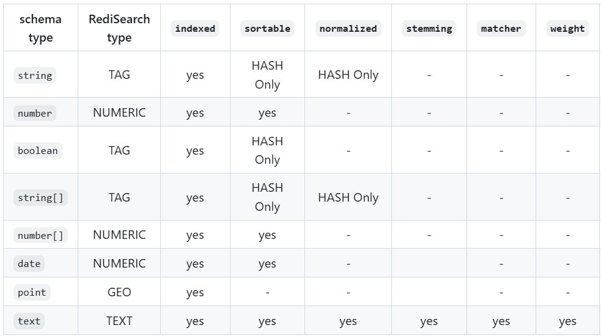

### Tutorial: Using Redis-OM in Node.js

Let's create a step-by-step tutorial on using Redis-OM in Node.js with ES6 import syntax, incorporating the given object model.


#### Entities and Schemas
> Redis OM is all about saving, reading, and deleting *entities*. An [Entity](https://github.com/redis/redis-om-node/blob/main/docs/README.md#entity) is just data in a JavaScript object that you want to save or retrieve from Redis. Almost any JavaScript object is a valid `Entity`.

> [Schemas](https://github.com/redis/redis-om-node/blob/main/docs/classes/Schema.md) define fields that might be on an `Entity`. It includes a field's type, how it is stored internally in Redis, and how to search on it if you are using RediSearch. By default, they are mapped to JSON documents using RedisJSON, but you can change it to use Hashes if want.

> Additional field options can be set depending on the field type. These correspond to the [Field Options](https://redis.io/commands/ft.create/#field-options) available when creating a RediSearch full-text index. Other than the `separator` option, these only affect how content is indexed and searched.

> There are several other options available when defining a schema for your entity. Check them out in the [detailed documentation](https://github.com/redis/redis-om-node/blob/main/docs/classes/Schema.md) for the `Schema` class.

> This README is pretty extensive, but if you want to check out every last corner of Redis OM for Node.js, take a look at the complete [API documentation](https://github.com/redis/redis-om-node/blob/main/docs).


#### Step 1: Set Up Your Project
1. **Initialize a new Node.js project**:
    ```bash
    mkdir redis-om-tutorial
    cd redis-om-tutorial
    npm init -y
    ```

2. **Install necessary dependencies**:
    ```bash
    npm install express redis redis-om dotenv
    ```

3. **Configure ES6 modules**:
    In your `package.json`, add `"type": "module"`:
    ```json
    {
      "name": "redis-om-tutorial",
      "version": "1.0.0",
      "main": "index.js",
      "type": "module",
      "scripts": {
        "start": "node index.js"
      },
      "dependencies": {
        "express": "^4.17.1",
        "redis": "^4.0.0",
        "redis-om": "^0.1.0",
        "dotenv": "^10.0.0"
      }
    }
    ```


#### Step 2: Set Up Redis
1. **Run Redis Stack**:
    You can run Redis Stack using Docker:
    ```bash
    docker run -p 6379:6379 redis/redis-stack:latest
    ```


#### Step 3: Create Your Application
1. **Create a `.env` file**:
    ```.env
    REDIS_URL=redis://localhost:6379
    ```

2. **Create `index.js`**:
    ```javascript
    import express from 'express';
    
    const app = express();
    app.use(express.json());

    app.listen(3000, () => {
      console.log('Server is running on port 3000');
    });
    ```


#### Step 4: Define a Schema and Repository
1. **Create `schema.js`**:
    ```javascript
    import { Schema } from 'redis-om';

    const writersSchema = new Schema('writers', {
      full_name: { type: 'string' },
      notable_works: { type: 'string[]' },
      description: { type: 'string' }
    });

    export { writersSchema };
    ```

2. **Create `redis.js`**:
    ```javascript
    import 'dotenv/config'
    import { createClient } from 'redis'

    const redis = createClient({ 
            socket: {
                port: process.env.REDIS_PORT,       // Redis port
                host: process.env.REDIS_HOST,       // Redis host            
            }, 
            password: process.env.REDIS_PASSWORD,   // Redis password 
        })

    redis.on('error', (err) => console.log('Redis Client Error', err));

    export { redis }
    ```


3. **Create `repository.js`**:
    ```javascript
    import { Repository } from 'redis-om';
    import { redis } from './redis.js'
    import { writersSchema } from './schema.js';

    const writersRepository = new Repository(writersSchema, redis);

    export { writersRepository };
    ```


#### Step 5: Create an Index
1. **Create an index for the `writers` schema**:
    ```javascript
    await writersRepository.createIndex();
    ```

    Add this line to your `index.js` after the client connection:
    ```javascript
    import { redis } from './redis.js'
    import { writersRepository } from './repository.js';

    await redis.connect()
    await writersRepository.createIndex();
    ```


#### Step 6: Create Routes
1. **Create `routes.js`**:
    ```javascript
    import express from 'express';
    import { writersRepository } from './repository.js';

    const router = express.Router();

    router.post('/writer', async (req, res) => {      
      const writer = await writersRepository.save(req.body);

      res.send({ id: writer[EntityId] });
    });

    router.get('/writer/:id', async (req, res) => {
      const writer = await writersRepository.fetch(req.params.id);

      res.send(writer);
    });

    export default router;
    ```

2. **Update `index.js` to use the routes**:
    ```javascript
    import express from 'express';
    import router from './routes.js';
    import { redis } from './redis.js'
    import { writersRepository } from './repository.js';

    const app = express();
    app.use(express.json());

    // Create index for the Writer schema
    await redis.connect()
    await writersRepository.createIndex();

    app.use('/api', router);

    app.listen(3000, () => {
      console.log('Server is running on port 3000');
    });
    ```


#### Step 7: Run Your Application
1. **Start your server**:
    ```bash
    npm start
    ```

2. **Test your API**:
    You can use tools like Postman or curl to test your API endpoints.

And that's it! You've set up a basic Node.js application using Redis-OM with ES6 import syntax, incorporating the given object model and creating an index. 


#### Retrospection
Regarding to our case, as of this writing, `redis-om` doesn't support `vector` type yet. Valid types are: `string`, `number`, `boolean`, `string[]`, `number[]`, `date`, `point` and `text`.


Index `demo:writers:idx_vss` has to be maintained manually by ourself: 
```javascript
const writersSchema = new Schema('writers', {
        full_name: { type: 'string', sortable: true },
        notable_works: { type: 'string[]', sortable: true },
        description: { type: 'text', sortable: true }
    }, {
        dataStructure: 'JSON',
        indexName: 'demo:writers:idx_vss'
    })
```

It is hazardous to call `createIndex`, in addition, indexing  `embedding` field is practically unuseful albeit it is possible: 

```javascript
embedding: { type: 'number[]' }
```

The only palpable issue is unable to select which fields to return. So, use it on your own risk... 
```javascript
const writers = await writersRepository.search().where('notable_works').contains('1984').return.all()

const writers = await writersRepository.search().where('description').match('political').return.all()

const writers = await writersRepository.searchRaw('@description:(A master of Gothic fiction and poetry)').return.all()
```


#### Bibliography
1. [Beyond the Cache with Redis + Node.js | Guy Royse](https://youtu.be/5NGVIhLAYVA)
2. [Redis Stack Workshop: Redis Stack OM Library for Node.js](https://youtu.be/KUfufrwpBkM)
3. [redis-om](https://github.com/redis/redis-om-node/tree/main)
4. [redis-om detailed documentation](https://github.com/redis/redis-om-node/blob/main/docs/classes/Schema.md)
5. [redis-om API documentation](https://github.com/redis/redis-om-node/blob/main/docs)
6. [node-redis](https://www.npmjs.com/package/redis)


### EOF (2025/04/23)